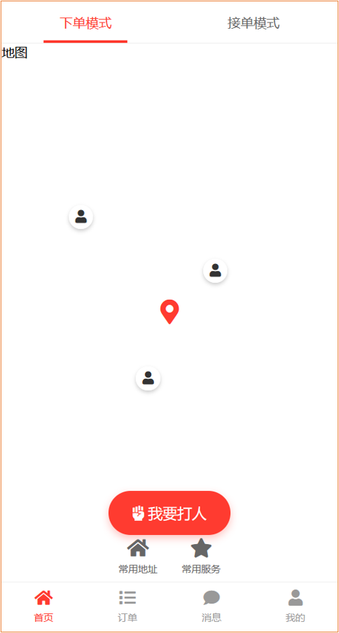
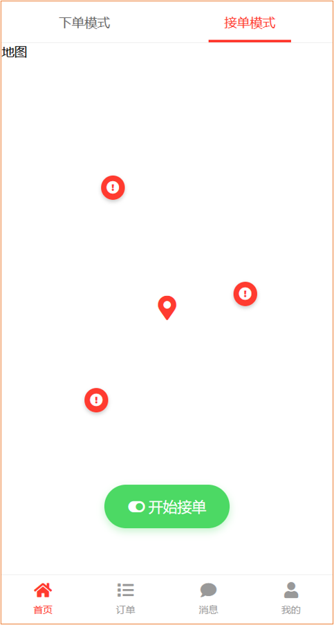

看到有很多文章说 “用Claude 3小时开发了个APP，赚了XXX万”，“用 Cursor 3分钟开发了个网站...”，一个比一个厉害。

那么就实际操作一下，看看是不是真的那么厉害。

包括 README.md 在内，一共 4 个文件，第一次生成了 README.md 文件，然后我让 Cursor 开始编写代码，设计APP原型图。大概生成 500 行代码后就会断掉，然后需要让 Cursor 继续生成。

